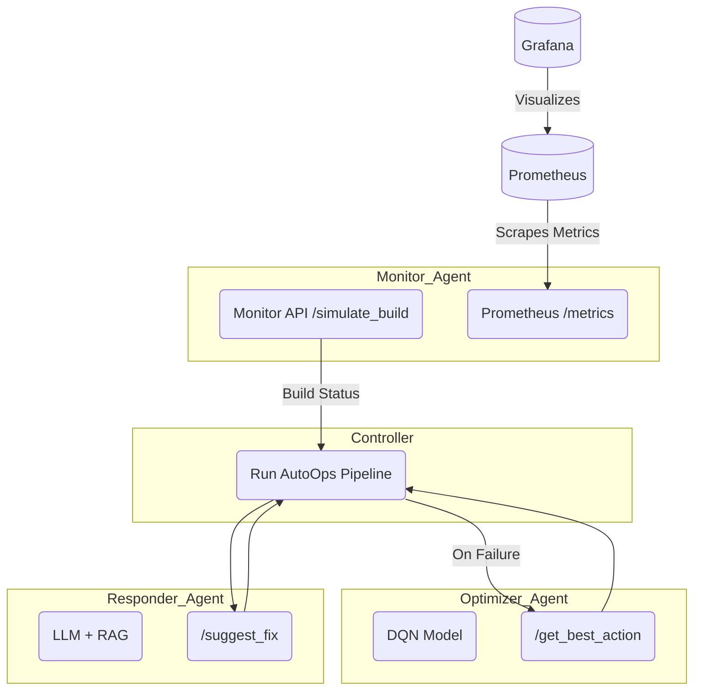

# AutoOps – Autonomous DevOps Workflow Agent

AutoOps is a multi-agent system for automating DevOps tasks such as build monitoring, CI/CD pipeline optimization, and incident response.  
It combines Reinforcement Learning (RL), Retrieval-Augmented Generation (RAG), and observability tools (Prometheus/Grafana) to create an AI-driven DevOps pipeline.

---

## Overview

The system consists of three agents:

| Agent              | Purpose                                                                 |
|-------------------|-------------------------------------------------------------------------|
| Monitor Agent      | Simulates build execution and exposes metrics for Prometheus            |
| Optimizer Agent    | Uses a DQN (RL) model to select the optimal build configuration          |
| Responder Agent    | Uses RAG and an LLM to generate fix suggestions when a build fails       |

A controller orchestrates the agents and executes the end-to-end AutoOps workflow.

---

## Architecture



---

## Technologies Used

- **FastAPI** – Agent APIs  
- **Prometheus** / **Grafana** – Monitoring and visualization  
- **Stable-Baselines3 (DQN)** – Pipeline optimization agent  
- **sentence-transformers + Flan-T5** – RAG-based responder  
- **Python** – Controller / Orchestration

---

## How to Run (Single Demo)

```bash
pip install -r requirements.txt
python autoops_runner.py
```

### Example Output
```
[Monitor]  -> {'status': 'failed', 'duration': 2.34, 'error': 'Out of memory during build'}
[Optimizer] -> {'action_id': 1, 'action_description': 'use cache'}
[Responder] -> {'suggestion': 'Increase CI runner memory limit to 2–4GB or enable build cache'}
```

---

## Continuous Mode (Controller Loop)

```bash
python -m uvicorn api.main:app --port 9000
```

---

## Knowledge Base (RAG Source)

- agents/responder_agent/knowledge_base/incidents.md  
Contains known DevOps incidents such as:
  - Out of Memory during Build  
  - Docker Pull Error  
  - Prometheus Target Down  
  - FastAPI 404 on /metrics

---

## Potential Extensions (Future Work)

- Integrate Slack / Discord bot interface
- Replace Flan-T5 with GPT-3.5 for higher-quality suggestions
- Use FAISS or ChromaDB to persist the RAG vector store
- Package system as Kubernetes services (Helm / manifests)
